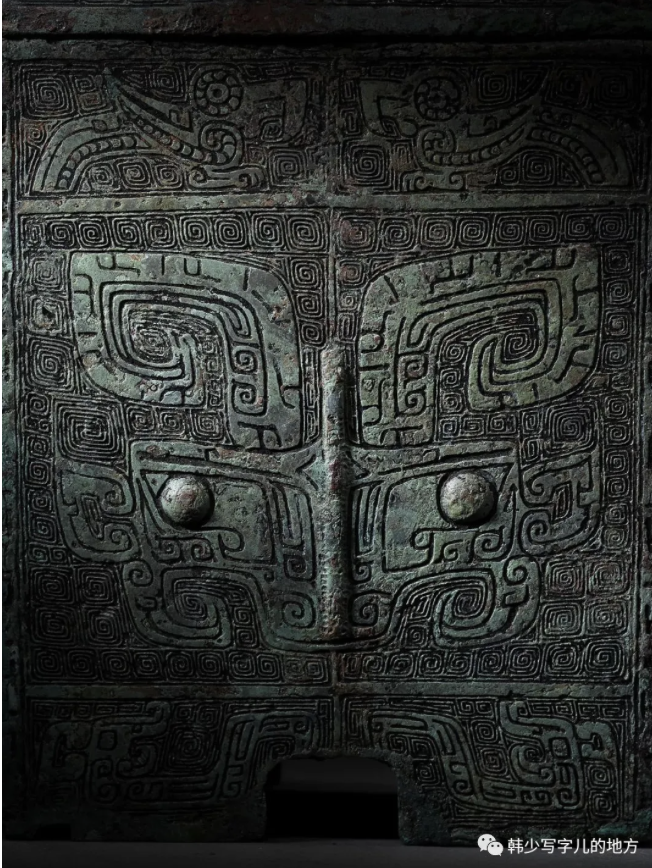
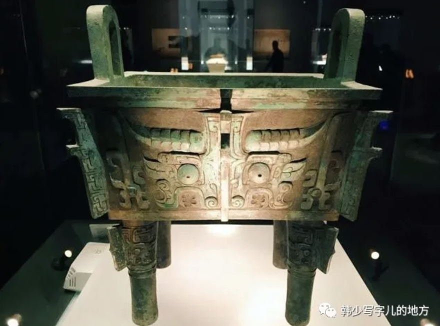
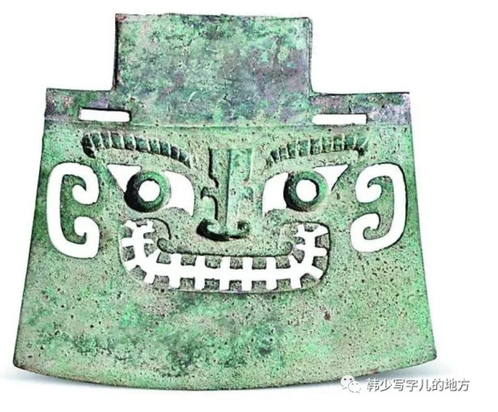
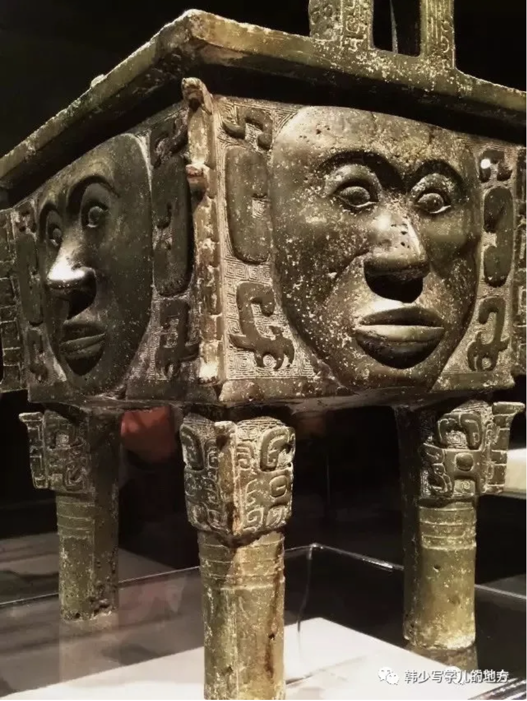

## 青铜饕餮

传说中的夏铸九鼎，大概是开启青铜时代的标记。

此时的社会，虽然仍在氏族共同体的社会结构基础上，但早期宗法制统治秩序在逐渐形成和确立。贵族与平民开始了阶级区分。原本属于全体人民的巫术礼仪被统治者所垄断，成为社会统治的法规，具有浓厚宗教性质的巫史文化开始了。

（美从来不是悬浮在真空里的。一个时代如何组织权力，如何解释世界，如何分配神圣，往往就决定了这个时代会生产出什么样的审美形式。就像黑格尔认为美是时代精神的感性表达：夏商周的政治，总要依赖神秘的巫术，把阶级的统治说成上天的旨意。以饕餮为突出的青铜器纹饰，以超世间的神秘威吓的动物形象，表示出这个初生阶级对自身统治地位的肯定和幻想。）

（人类开始把思想与现实联系起来，这是巨大的进步。哪怕这种思想在今天看来更像是一种魅惑的幻想，但至少它意味着，人不再只是在自然中被动生存，而是开始主动用观念去解释现实、组织现实、支配现实。从这个意义上说，巫术未必只是蒙昧，它也是早期精神世界的一种建构。物质劳动与精神劳动，正是在这里第一次被强力地缠绕在一起。）

夏商周时期的青铜器，是完全变形了的、幻想的、可怖的动物形象。它们呈现给你的是一种神秘的威力和狰狞的美。它们具有威吓神秘的力量，这力量似乎指向超世间的权威神力。它们的美，源于一种具有宗教性的原始无限恐怖。

殷周青铜器大多是为颂扬种种野蛮吞并战争的祭祀礼器。它对外族是畏惧恐吓的符号，对本族是一种带有以武力保护自我性质的耀武扬威。这种双重性的观念便凝聚在此怪异狞厉的形象之中。

（这魅力，某种程度上源于历史消极一面的深沉力量。现代主义常讲“审丑”，但也许“丑”之所以能进入审美，并不是现代人才第一次发现，而是人类很早就已经在凝视那些暴烈、怪异、危险、阴森的东西。只不过，只有当我们站在一个相对安定和进步的时代回望它们时，才有余裕把恐惧转化成审美。否则，我们就不是欣赏者，而只是被吞没其中的“画中人”。）

但不是任何狰狞神秘都能成为美，缺少了历史必然的命运力量，再如何张牙舞爪、威吓恐惧，也只是突显其空虚可笑而已。体现出历史前进的力量和命运的艺术，才能真正成为审美对象。

### 线的艺术

与青铜同时出现的，还有汉字。汉字是在彩陶纹饰上的抽象几何纹基础上，更为自由多样的线的曲直运动和空间构造，表现出种种形体姿态、情感和气势力量。

书法把象形的模拟图画，变为更集中、更纯粹的抽象线条和结构，这是一种“有意味的形式”。通过结构的疏密，点画的轻重，行笔的缓急……，就像音乐艺术从自然界的群声里抽出乐音来，发展这乐音间相互结合的规律，用强弱、高低、节奏、旋律等有规律的变化来表现自然与社会的形象和人的情感，这是一种有内容的形式。

（书法、音乐、绘画之间或许真的有某种高度同构。它们表面上分别属于不同感官，实则都在处理“节奏”“张力”“呼吸”“密度”“运动方向”这些更底层的东西。换句话说，人感受到美，未必总是因为看见了什么对象，而可能是因为感受到了某种有生命感的形式运动。线条之所以动人，也许正因为它像旋律一样，会呼吸、会停顿、会冲撞、会回旋。）

### 青铜时代的尾声

春秋时期，无神论思潮站上历史舞台，殷周以来的巫术宗教传统迅速褪色，失去神圣的地位。统治者再也无法用原始的、不可言说的神秘来威吓人民了。所以，此时的青铜器“失其权威”，它变成世俗化、自由生动的艺术品了。然而，当青铜艺术只能作为表现高度工艺技巧水平的艺术品时，实际便已到它的终结之处。春秋战国青铜巧则巧矣，但与狞厉之美的殷周青铜器一比较，则力量之厚薄，气魄之大小，内容之深浅，审美价值之高下，就高下立判了。十分清楚，人们更愿欣赏那狞厉神秘的青铜饕餮的崇高美，它们毕竟是那个“如火烈烈”的社会时代精神的美的体现。它们才是青铜艺术的真正典范。
