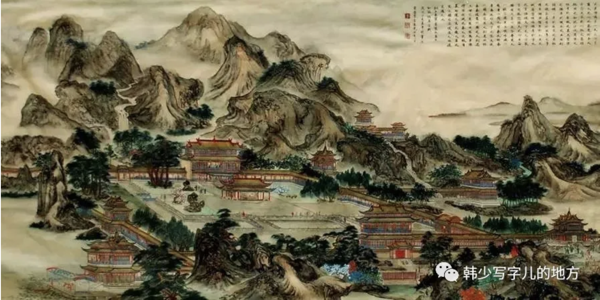
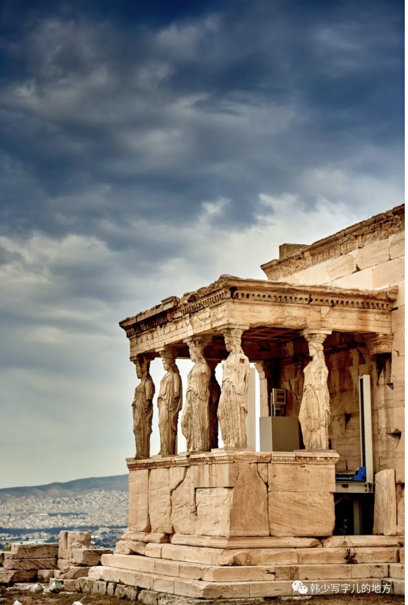
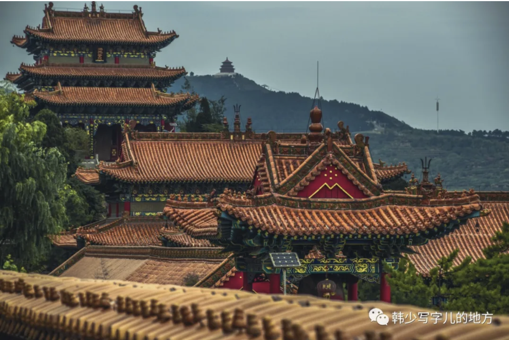
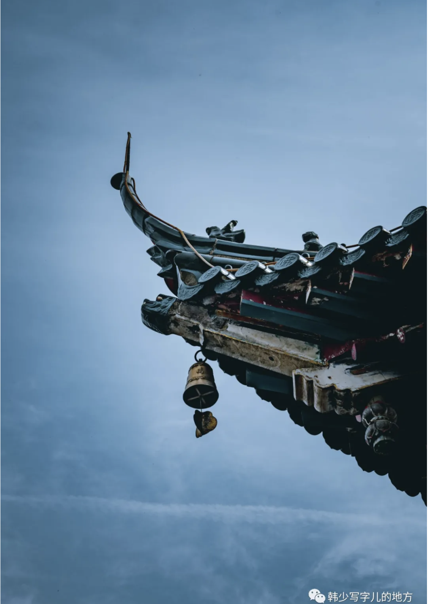
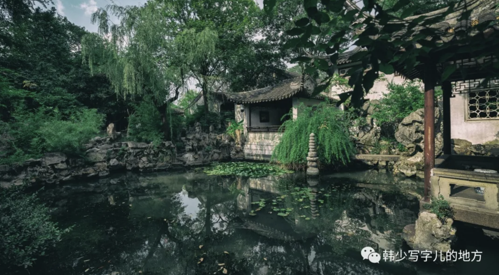

## 儒道互补

先秦，一般指春秋战国，它以氏族公社基本结构解体为基础，是中国古代社会最大的激剧变革时期。在意识形态领域，也有着最活跃的碰撞，而贯穿这百家争鸣的思潮，便是理性主义。而儒道相辅相成，奠定了汉民族的处世价值观。

不管是好是坏，是批判还是继承，孔子在塑造中国民族性格和心理结构上的历史地位，已是一种难以否认的客观事实。

（孔子最深的影响，或许不只是在思想史里，而是在无数普通人的行为习惯、情感方式和判断标准里。很多中国人未必真的读过儒家经典，但会天然重视亲情、秩序、分寸、责任、关系、克制，这种深层心理结构本身就是儒家长期沉淀下来的结果。）

儒家思想把传统礼制归结和建立在亲子之爱这种普遍而日常的心理基础上。把一种本来没有多少道理可讲的礼仪制度予以实践理性的心理学解释，从而把外在的强制性规范，变为主动性的内在欲求，使情感不再像石器时代和青铜时代般导向异化了的神学大厦和偶像符号，而将其抒发于日常伦理的社会人生中。

（无论是寄托神、偶像、宗教还是日常伦理，都指向着一件异常重要的事——安身立命。事实上这非常重要，且经常被我们忽略着。人并不是只靠纯粹理性活着的，人还需要在世界里找到一个可以安放心灵的位置。儒家的意义就在于，它把这种安顿从遥远神秘的彼岸，拉回到了现实可行的人伦秩序中。它未必浪漫，却极其稳固；未必高蹈，却极其耐久。）

理性精神是先秦各派的共同倾向，祛魅是其中相当重要的一部分。孔子世界观中对鬼神的怀疑以及对人生的积极进取（“敬鬼神而远之，可谓知矣”，“知其不可为而为之”），一方面发展为荀子的乐观进取的无神论（“制天命而用之”），另一方面演化为庄周的泛神论。

（这是翻天覆地的变化。中国早在两千年前就出现了可以被视为某种“启蒙前史”的去宗教性束缚的理性崇拜精神，这导致一切宗教在这片土地上总是难以完全适从。但我们当然有信仰，也有能够代替宗教的政治与伦理手段，我们以儒道安身立命。也许正因如此，中国人对“神”的态度常常不是绝对皈依，而是带着现实感的拿捏、调和与转化。我们不是没有超越性追求，只是更习惯把它安放在现实人生之内。）

老庄道家有着似乎神秘的说法，同样无关鬼神，却比儒家以及其他任何派别更抓住了艺术审美的基本特征：形象大于思想；想象重于概念；言不尽意，乃凝于神。

（这正是我所说的“隔层纱的美”。道家最迷人的地方，恰恰在于它不把世界说透，而是给世界留出回旋、暧昧、流动和不可穷尽的空间。真正高级的美，往往也不在把意义讲尽，而在保留余味、留白和不可言说。艺术之所以动人，很多时候不是因为它说清了什么，而是因为它唤起了什么。道家在这一点上，几乎天然地更接近艺术本身。）

儒道是对立的，一个入世、一个出世；一个乐观进取，一个消极避退；但实际上它们刚好互相补充，不但“兼济天下”和“独善其身”经常是后世士大夫的互补人生路途，“身在江湖”和“心存魏阙”也成为中国历代知识分子的信念。前者强调艺术的外在功利，如果说这个狭隘实用的功利框架，造成对艺术和审美的束缚，那么后者则恰恰给予这种框架强有力的冲击，它们各自为中国艺术发展提供持久的动力。所以说，儒与道不止对立，还有补充。

（中国文化最有意思的地方，或许恰恰不在纯粹，而在这种互补。人不可能永远入世，也不可能永远出世；不可能永远奋发，也不可能永远退守。于是儒给人以责任，道给人以呼吸；儒让人承担世界，道让人放过自己。它们并不是谁取代谁，而是在漫长历史中共同塑造了一种极具弹性的生命结构。中国人的韧性，很大程度上就来自这种双重精神资源：进可以有担当，退也可以有安顿。）

## 赋比兴原则

尽管甲骨、金文、易经都含有具有审美意义的片段文句，但它们毕竟难以卒读，难以唤起人们的审美感受。真正可以作为文学作品看待的，仍然首推春秋战国左右的《诗经》和先秦诸子的散文。文字由记事、祭神变为抒情、说理。《诗经》中的民歌与咏叹，奠定了中国诗以抒情为主的基本美学特征。

（这是中国诗的开山鼻祖，像《源氏物语》之于日本文学风格，《工厂大门》之于电影史。或许内容现在看来不是那么精彩，但它们的存在本身伟大至极。所谓开端的意义，本就不完全在成熟，而在定向。它第一次规定了一种可能性，让后世知道，一种文明可以如何感受、如何表达、如何书写自己。）

后人由《诗经》归纳出赋比兴的美学原则。“赋者，敷也，敷陈其事而直言之者。比者，以彼物比此物也。兴者，先言他物以引起所咏之词也。”“不道破一句”一直是中国美学的重要标准之一，比兴正是将主观情感与客观景物合而为一的产物。“正言直述则易于穷尽而难感发，惟有所寓托。”、“反复讽咏，言有尽而意无穷，则神爽飞动，手舞足蹈而不自觉。”这就是比兴的艺术性所在，奠定了“托物寓情”胜于“正言直述”的中国诗传统。

（《诗经》奠定了中国古代文学的抒情传统，《荷马史诗》或许奠定了西方古代文学的叙事传统。两者并无高下，只是文明重心不同。中国诗歌从很早开始就更在意“情如何被寄托”“意如何不说尽”，于是留白、含蓄、寄兴、余味成为核心美学。这也深刻影响了后来的词、曲、书、画，甚至影响了中国人整体的表达方式：不把话说满，不把情说死，让意味在言外继续生长。）

孟文以相当整齐的排比句法为形式，极力增强逻辑推理中的情感力量，使其说理有一种不可阻挡的气势。庄文以奇特夸张的想象为主线，以散而整的句法为形式，使说理有一种高举远慕的飘逸。它们不都正是由于充满了丰富饱满的情感和想象，而使其说理成为文学的吗？它们与中国诗歌的民族美学特征不又是一脉相通的吗？

五亩之宅，树之以桑，五十者可以衣帛矣。鸡豚狗彘之畜，无失其时，七十者可以食肉矣。百亩之田，勿夺其时，数口之家，可以无饥矣；谨庠序之教，申之以孝悌之义，颁白者不负戴于道路矣。七十者衣帛食肉，黎民不饥不寒，然而不王者，未之有也。（《孟子·寡人之于国也》）

北冥有鱼，其名为鲲。鲲之大，不知其几千里也；化而为鸟，其名为鹏。鹏之背，不知其几千里也；怒而飞，其翼若垂天之云。（《庄子·逍遥游》）

## 建筑艺术

春秋战国时期，一股追求“美轮美奂”的建筑热潮盛极一时。从对建筑的避风雨的实用追求，跨越到对非功利的艺术性追求。这股热潮在秦始皇大修阿房宫达到最高点。

（由实用到非实用的变化，是巨大的跨越，这是艺术的一大特性。一个东西如果只满足生存需要，它还只是工具；而当人开始要求它还要美，要求它承载气势、身份、情感和想象时，艺术便真正出现了。对建筑而言尤其如此：房屋可以遮风避雨，但宫殿、台榭、楼阁显然已经不只是为了住，它们在诉说权力、秩序、审美与时代精神。）

各民族的主要建筑多半是供养神的庙堂，如希腊神殿、伊斯兰建筑、哥特教堂等。而中国自从儒学代替宗教后，建筑是与世俗生活紧密相连的。它不是高耸入天、指向神秘的上苍观念，而是平面铺开、引向现实的人间联想；不是阴冷的石头，而是暖和的木质；不是在异常空旷的空间中去获得某种神秘、紧张的灵感、悔悟或激情，而是提供某种明确实用的观念情调。

（先秦理性解放带来的祛魅精神，影响了后世的方方面面。中国建筑之所以少有那种压迫性的崇高神圣感，而更多呈现出秩序、亲和、展开与可居性，正是因为它服务的重心始终是人间，而非彼岸。这很能说明中国文明的特质：它不是没有宏大想象，而是更愿意把宏大安放在现实生活的秩序里。于是建筑不再只是通天之梯，而更像是一种有伦理感、有温度的空间组织方式。）

中国木结构建筑的屋顶，往往有个向上微翘的飞檐（汉以后），使这个本应沉重地往下压的大帽，反而随着线的曲折，显出向上挺举的飞动轻快，配以宽厚的台基，使整个建筑安定踏实而毫无头重脚轻之感。

长城的每段体制是完全雷同的，像一条无尽的龙蛇在作永恒的飞舞。它在空间上的连续本身即展示了时间中的绵延，成了我们民族伟大活力的象征。

（长城最震撼人的，不只是高大或艰巨，而是那种无尽延展所形成的时间感。它像一条巨大的线，把地理空间缝合起来，也把漫长历史可视化了。于是它不再只是防御工事，而成了一种文明意志的形象化表达。中国人为什么容易对长城生出复杂情感，也许正因为它既是现实的建筑，也是民族记忆被拉长之后的形状。）

园林艺术打破了宫殿建筑庄重的对称性，空间有畅通，有阻隔，变化无常，出人意料，可以引起更多的想象和情感。以多样有机布局的园林建筑，体现了封建后期文人士大夫们更为自由的艺术观念和审美理想。几乎是同一时期的园林建筑与山水画，都在追求着人为的自然化，人与自然合为一体。实际上，它是以玩赏的自由园林（道）来补足居住的整齐屋宇（儒）罢了。

（中国建筑内部，其实一直就藏着儒道互补的结构。屋宇讲秩序、礼法、居住、稳定，是儒；园林讲游观、变化、自然、留白，是道。一个解决现实生活如何安顿，一个解决精神世界如何舒展。于是最理想的中式空间，从来不是只有秩序，也不是只有放逸，而是让秩序中有呼吸，让自由中有分寸。）

