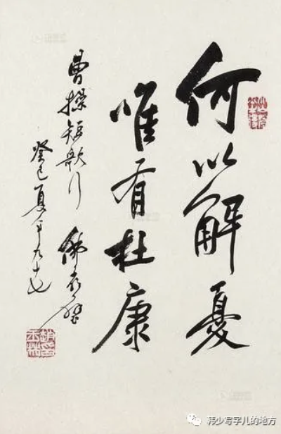
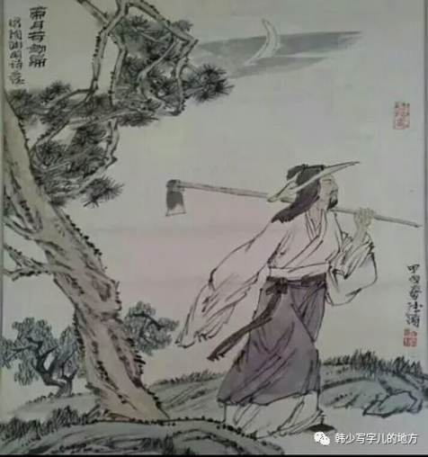
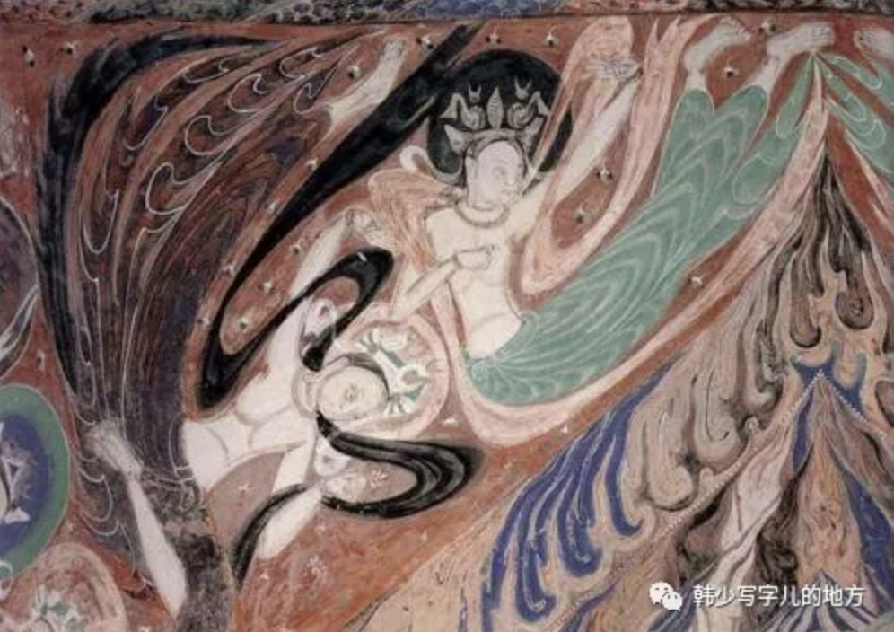

## 魏晋风度

### 一、人的主题

魏晋在中国历史上是一个重大变化时期。无论经济、政治、军事、文化和整个意识形态，包括哲学、宗教、文艺等，都经历转折。这是继先秦之后第二次社会形态的变异所带来的。秦汉繁荣的城市商品经济相对萎缩，东汉以来的庄园经济日益巩固和推广。分裂割据、等级森严的门阀士族阶级占住了历史舞台的中心，中国前期封建社会正式揭幕。

在时代动乱和农民革命的冲击下，迂腐荒唐，既无学术效用又无理论价值的两汉经学终于垮台。于是哲学重新解放，虽然在时间、广度、规模上比不上先秦，但思辨哲学所达到的纯粹性和深度上，却是空前的。与讲究实用的两汉经学相比，一种真正思辨的、理性的“纯”哲学产生了，一种真正抒情的、感性的“纯”文学产生了。简单说来，就是人的觉醒。

（它不是现代意义上的个体主义，也不是后来那种完全私人化的自我表达，而是在旧的价值体系松动之后，人第一次如此集中地回到自己身上：我是谁，我为什么活着，我怎样面对死亡、命运、痛苦与短暂。哲学变纯了，文学也变纯了，本质上都是因为“人”不再只是秩序中的角色，而开始成为问题本身。）

一种对生死存亡的重视、哀伤，对人生短促的感慨、喟叹，从建安直到晋宋，在相对一段时间内弥漫开来，成为时代的典型音调。曹氏父子有“对酒当歌，人生几何”（曹操）；“人亦有言，忧令人老，嗟我白发。生亦何早”（曹丕）。阮籍有“人生若尘露，天道邈悠悠，……孔圣临长川，惜逝忽若浮”。王羲之有“死生亦大矣，岂不痛哉……。固知一死生为虚诞，齐彭殇为妄作，后之视今已有今之视昔，悲夫！”陶潜有“悲晨曦之易夕，感人生之长勤。”……他们唱出的是同一哀伤，同一感叹，同一思绪。在表面看来似乎是如此颓废、悲观、消极，深藏着的恰恰是它的反面，是对人生、生命、命运的强烈欲求和留恋。而它们正是对原来占据统治地位的奴隶制意识形态——经术、宿命，鬼神迷信的怀疑和否定：正是对外在权威的怀疑和否定，才有内在人格的觉醒和追求。

整个社会日渐动荡，战祸不已，死亡枕藉，以前所宣传和相信的那套伦理道德、鬼神迷信、烦琐经术等等规范，都是不怎么可信可靠的，那么个人存在的意义和价值就突出出来了，既然如此，为什么不尽情享受呢？所以，“昼短苦夜长，何不秉烛游”；“不如饮美酒，披服执与素”；如何有意义地充分把握住这短促而苦难的人生，便突出出来了。这实质上是人的觉醒，即在怀疑和否定传统信仰的条件下，人对自己生命、意义、命运的重新发现、思索、把握和追求。

正因如此，才使这些公开宣扬“人生行乐”的诗篇，不同于后世贪图享乐、腐败堕落之作。它们却正是在这种人生感叹中抒发着一种向上的、激励人心的意绪情感。在“对酒当歌，人生几何”底下的，恰恰是“烈士暮年，壮心不已”的老骥长嘶；在建安风骨的人生哀伤下的，恰恰是建功立业的“慷慨多气”；在“死生亦大矣，岂不痛哉”后面的，恰恰是“群籁虽参差，适我无非新”的人生慰藉和哲理安息。

（所以魏晋最迷人的地方，就在于它把脆弱与昂扬放在了一起。不是因为不怕死才勇，而是因为太知道人生有限，才更想活出一点精神分量。这种力量和后世那种安稳环境中的豪言壮语完全不同，它带着真实的痛感，也因此更有说服力。真正有风骨的时代，常常不是没有绝望，而是在绝望里仍然不肯放弃精神的挺立。）

有自给自足不必求人的庄园经济，有时代沿袭的社会地位，门阀士族们的心思由外在转向内心，由社会转向自然，由经学转向艺术。“目送归鸿，手挥五弦；俯仰自得，游心太玄。”他们追求长生，服药炼丹，饮酒任气，高谈老庄，双修玄礼，既纵情享乐，又满怀哲意，这就构成了似乎是那么潇洒不群、那么超然自得、无为而无不为的所谓魏晋风度。

（魏晋风度的表面确实很迷人：饮酒、清谈、服药、任气、谈玄、尚美，好像整个人生都轻起来了。但它真正值得注意的地方，不是这层姿态，而是为什么会出现这种姿态。那是一种对现实政治失望后，把生命重心从功业转向精神自我、从外部秩序转向内部风神的集体选择。它并不是简单的逃避，而是把如何做自己推到了前所未有的重要位置。）

### 二、文的自觉

魏晋的门阀大族，沿袭着富贵荣华，不受皇权支配，失去了政治意义，诗文不再只是功利附庸和政治工具。自魏晋到南朝，讲求文辞的华美，文体的划分，文理的探求成为这一历史时期意识形态的突出特征。如《文赋》中对文体的区划和对文思的描述：诗缘情而绮靡，赋体物而浏亮。碑披文以相质，诔缠绵而凄怆。……遵四时以叹逝，瞻万物而思纷。悲落叶于劲秋，喜柔条于芳春。心懔懔以怀霜，志眇眇而临云。……其始也，皆收视反听，耽思傍讯。精骛八极，心游万仞。其致也，情曈曨而弥鲜，物昭晰而互进。……观古今于须臾，抚四海于一瞬。

（“文的自觉”是一个特别现代也特别珍贵的时刻。它意味着文学终于可以不只是为政教服务，而开始反过来关注自己：语言怎么组织，情感怎么发生，风格怎么区分，形式怎么成立。艺术开始意识到自己不是附庸，而是一个独立世界。这种自觉一旦出现，之后一切关于风格、体裁、辞采、韵味、文心的讨论，才真正有了基础。）

相对于两汉文艺“厚人伦，美教化”的功利艺术而言，文的自觉则是魏晋时期文学的特点，确认诗文具有自身的价值意义，“为艺术而艺术”，是文学在艺术性上的觉醒。玄言诗与山水诗，则是在创作题材上反映这种自觉。

“文的自觉”是一个美学概念，并非单指文学，还包括绘画与艺术。文的自觉（形式）和人的主题（内容）同是魏晋的产物。正是魏晋时期，严正整肃、气势雄浑的汉隶变为真、行、草、楷等多样体裁。它们以极为优美的线条形式，表现出人的种种风神状貌，从书法上表现出来的仍然主要是那种飘俊飞扬、逸伦超群的魏晋风度。

（这也再次说明，真正大的审美转向从来不是单一门类里的局部现象，而是整套精神气候的变化。文学变了，书法也变了；内容在讲人的觉醒，形式也在变得更自由、更轻灵、更能表现个体风神。汉代那种整体雄浑的力量感，到魏晋则转化成了线条中的风骨、节奏中的神采、体态中的逸气。形式本身，已经开始像人一样有性格了。）

### 三、阮籍与陶潜

魏晋风度产生与充满动荡、混乱、灾难、血污的时代，外表尽管装饰得如何轻视世事，洒脱不凡，内心却更强烈地执着人生，非常痛苦。这构成了魏晋风度内在的深刻一面。

（所以真正的魏晋风度，从来不只是潇洒。如果只看到清谈、饮酒、竹林、任诞，而看不到它背后的血污、压迫、动荡和痛苦，就会把它误读成一种表面的文人姿态。它之所以迷人，恰恰因为这份轻逸不是天然轻松，而是在重压之下仍努力保持的一种精神姿态。越是痛苦，越显得风度珍贵。）

阮籍的82首咏怀诗隐晦之至。一方面，“一飞冲青天。旷世不再鸣。岂与鹑鷃游。连翩戏中庭。”，痛恶环境，蔑视现实，要求解脱；同时，又“宁于燕雀翔，不随黄鹄飞，黄鹄游四海，中路将安归”，现实逼他仍得低下头来，保全性命。所有这些，都说明阮籍的诗之所以那么隐而不显，实际是包含了欲写又不能写的巨大矛盾和苦痛。别看他作为竹林名士是那么放浪潇洒，其内心的冲突痛苦是异常深沉的。“谁云云石同，泪下不可禁”，“终身履薄冰，谁知我心焦”，便一再出现在他笔下的诗句。把残酷政治迫害的哀伤曲折而强烈地抒发出来，大概从来没有人像阮籍写得那样深沉美丽。正是这一点，使所谓魏晋风度有了真正深刻的内核，这是魏晋风度美学力量之所在。

（阮籍不是单纯反抗，也不是单纯退避，而是在两者之间被反复拉扯。于是他的隐晦不是技巧，而是生存条件本身；他的美，不是优雅，而是痛苦被压进语言之后形成的深沉回响。魏晋风度如果要有一个最锋利、最受伤的内核，大概确实就在阮籍这里。）

陶潜可算作它的另一人格化的理想代表。陶潜的超脱尘世与阮籍的沉湎酒中一样，只是一种外在现象。“荣华诚足贵，亦复可怜伤”；“本不植高原，今日复何悔”。陶潜坚决从上层社会的政治中退了出来，把精神的慰安寄托在农村生活的饮酒、读书、作诗上，他没有后期封建社会士大夫对整个人生社会的空漠之感，相反，他对人生、生活仍有很高的兴致。不是外在的轩冕荣华、功名学问，而是内在的人格和不委屈以累己的生活，才是正确的人生道路。他把人的觉醒提到了一个远远超出同时代人的高度。于是，桃花源记与五柳先生成了多少后世隐士的所思所想，“采菊东篱下，悠然见南山”成了多少逸士的毕生向往。

陶潜和阮籍在魏晋时代分别创造了两种迥然不同的艺术境界，一超然事外，一慷慨任气。它们以深刻的形态表现了魏晋风度、应该说，不是建安七子，不是二王、颜、谢，而是他们两个人，才真正是魏晋风度的最高优秀代表。

（如果说魏晋风度是一种时代精神，那么阮籍和陶潜几乎就是它最典型的两种人格答案：一种是在重压中扭曲着坚持，一种是在退出后平静地守住自己。一个深痛，一个清旷；一个像裂开的弦，一个像缓慢落下的日光。但他们都同样把“人”推到了中心，也都同样不肯把人格交还给外在秩序。也正因此，他们才会成为魏晋风度最有说服力的代表。）

## 佛陀世容

把数百年之久的中国佛教艺术当作一个混沌的整体对待是不行的，重要的是历史的分析和具体的探索。概括来说，佛教艺术大体分三种，一以理想胜（魏），一以现实胜（宋），一以二者结合胜（唐）。

（佛教艺术在中国从来不是一整块铁板，它会随着时代现实、社会情绪、统治需求和审美趣味不断变化。也正因此，谈佛教艺术不能只谈宗教本身，还必须谈历史阶段。艺术总会比教义更诚实，因为它最终会把那个时代真正焦虑什么、渴望什么、逃避什么、相信什么，都悄悄暴露出来。）

### 一、悲惨世界

宗教是异常复杂的现象。它一方面蒙蔽麻痹人们于虚幻幸福之中；另方面广大人民在一定历史时期中如醉如狂地吸食它，又经常是对现实苦难的抗议或逃避。

（宗教最复杂也最真实的地方，大概正在这里。它当然可能是麻药，是遮蔽，是让人接受苦难的温柔陷阱；但与此同时，它也常常是人在现实实在太痛的时候，唯一能抓住的精神浮木。不能只看到它的虚幻，也不能只看到它的抚慰。人为什么需要宗教，很多时候不是因为愚昧，而是因为现实太难承受。）

佛教在中国广泛传播流行，并成为门阀地主阶级的意识形态，在整个社会占据统治地位，是在频繁战乱的南北朝。北魏与南梁先后正式宣布它为国教。

（这并不偶然。一个相对安稳而自信的社会，未必会如此迫切地拥抱彼岸；只有当现实变得极端不可靠，生命、财产、秩序和因果都接连崩塌时，人们才会如此大规模地把希望转移到来世、轮回和天国里。佛教的兴盛，某种意义上也是现实世界失去说服力的证明。）

石窟艺术的兴亡，反映了中华民族由接受佛教而改造消化它，而最终摆脱它。清醒的理性主义，历史主义的华夏传统终于战胜了反理性的神秘迷狂。宗教毕竟只是现实的麻药，天上到底仍是人间的折射。这是统治者的自我慰安和欺骗，又是他们撒向人间的鸦片和麻药。它是一种地道的反理性的宗教迷狂，其艺术音调是激昂、狂热、禁止、粗犷的。我们今天在这早已褪掉颜色、失去本来面目的壁画图像中，从这依稀可辨的大体轮廓中，仍可以感受到那种带有刺激性的热烈迷狂的气氛和情调：山村野外的荒凉环境，活跃飘动的人兽形象、奔驰放肆的线条旋律，运动型的形体姿态……成功地渲染和烘托出这些迷狂的艺术主题和题材，它构成了北魏壁画的基本美学特征。

（很有意思的是，即使今天那些壁画已经褪色残损，我们仍然能从轮廓和气势里感到一种迷狂的热度。说明真正强烈的艺术，不完全靠细节存活，而靠整体精神存活。北魏佛教艺术最打动人的地方，不是精致，而是那股近乎燃烧的情绪：世界这么苦，所以只能把全部信念都压到彼岸身上。那种狂热，不是从容的信仰，而是苦难逼出来的精神高烧。）

这是把苦痛和对于苦痛的意识和感觉当作真正的目的，在苦痛中愈意识到所舍弃的东西的价值和自己对它们的喜爱，愈长久不息地观看自己的这种舍弃，便愈发感受到把这种考验强加给自己身上的心灵的丰富。

（这其实触及了宗教审美里一个非常微妙的层面：痛苦本身会被转化成某种精神价值。越苦，越显得虔诚；越舍弃，越显得心灵高贵。于是痛苦不再只是不得已的现实遭遇，而会被重新解释成一种通向更高意义的途径。这当然有危险，因为它可能让人过度美化苦难；但也不得不承认，它确实解释了为什么那么多人会在宗教里找到一种庄严感。）

从东汉的瓦解到李唐的统一，四百年间尽管有短暂的和平和局部安定，整个社会总的来说是长期处在无休止的战祸、饥荒、动乱中。阶级和民族压迫剥削造成了杀戮和毁灭。总之，现实生活是如此悲苦，生命宛如朝露，身家毫无保障，事物似乎根本没有什么公平和合理，也毫不遵循什么正常的因果律。好人遭恶报，坏人占上风，为什么会这样？这似乎非理性所能解答，也不是儒家孔孟或道家老庄所能说明，于是佛教走进了人们的心灵。既然现实世界毫无公平和合理可言，那就把因果寄托于轮回，把合理委之于来生和天国。

（我觉得这一段几乎把佛教何以深入中国人心说明白了：不是因为现实已经足够合理，而恰恰是因为现实太不合理了。儒道都很强大，但它们更多是在此生里安顿人，而当此生本身已经千疮百孔、连最基本的公平都看不到时，人就会自然地转向一种把因果推迟到来世的解释结构。轮回和天国，某种意义上就是对现实失序的一种精神修补。）

可以想象，在当时极端残酷野蛮的战争动乱和社会压迫下，跪倒或端坐在这些宗教图像故事面前的渺小的生灵们，将以何等狂热激动而又异常复杂的感受和情绪，来进行自己灵魂的洗礼。

（今天站在石窟前看这些造像，很容易从艺术欣赏的角度进入，但如果真的把自己放回那个时代，也许首先感受到的不会是美，而是依靠。那些图像不是给现代游客看的，它们原本是给苦难中的人看的，是让人在现实已经无处可去时，至少还能在精神上找到一个可以寄托的地方。）

僧侣们把宗教石窟当作现实的梦境，把一切美妙愿望、悲伤叹息，统统在这里放下，努力忘却现实中的一切不公平、不合理。从而也就变得更加卑屈顺从，逆来顺受，更加愿意自我牺牲，以获取神的恩典。在苦难时代早已过去了的今天，我们将从这些艺术图景中去感受那通过美学形式沉淀着的历史。

（宗教艺术的矛盾也正体现在这里：它一方面安慰人，一方面也训练人顺从；一方面保存愿望，一方面又消解反抗。可正因如此，它才是如此复杂的历史沉淀。今天我们看这些图景，不只是看审美形式，也是在看一个时代怎样用神圣想象来处理现实苦难。）

信仰需要对象，膜拜需要形体。人的现实地位愈渺小，膜拜的佛的身躯便愈高大。那种神情奕奕、飘逸自得，似乎去尽人间烟火气的风度，形成了中国雕塑艺术的美的高峰。

（这句非常锋利：人的现实地位越渺小，佛的身躯就越高大。巨大佛像当然有审美震撼，但它的社会心理学意味也很清楚——正因为人太小、太脆弱、太无力，所以才需要把拯救者塑造得如此宏伟。某种程度上，神像的巨大，本身就是现实无力感的反向投影。）

在巨大的、智慧的、超然的神像面前匍匐着蝼蚁般的生命，而蝼蚁们的渺小生命居然建立起如此巨大而不朽的公平主宰，也正好折射着对深重现实苦难的无可奈何的强烈情绪。被压迫者跪倒在佛像前，是为了解除苦难，统治者匍匐在佛像前，也要求人民像他匍匐在神的脚下一样。他要作为神的化身来统治人间。

（这也说明，宗教从来不只是私人信仰，它很快就会进入权力结构。人民从佛前寻求安慰，统治者则从佛前学习合法性。于是宗教既是苦难者的心理支撑，也可能是统治秩序的延伸工具。真正复杂的历史现象，往往都同时具有这两面。）

### 二、走向世俗

与那种超凡绝尘、不可言说的智慧和精神性不同，唐代雕塑代之以更多的人情味和亲切感。佛像变得更慈祥和蔼，温柔敦厚关心世界的神情笑貌和君君臣臣各有职守的统治秩序，充分表现了宗教与儒家的同化合流。这是进一步的中国化，儒家思想与佛教融合。与中国传统思想不合的那些残酷悲惨的场景、故事，终于消失；代之以各种净土变，极乐世界。举目便是金楼玉宇。北魏壁画是对悲惨现实和苦痛的描述来取得精神的慰安，那么隋唐则相反，是以对欢乐幸福的幻想，来取得心灵的满足。

（佛教到了唐代，最明显的变化大概就是“可亲近”了。它不再那样冷峻、狂热、拒人千里，而开始长出温柔的人情味。这当然是中国化，也是世俗化。宗教一旦真正进入一个文明内部，往往就会慢慢改口音、改面貌、改表情，最后变得越来越像这个文明自己。唐代佛像之所以那么动人，也许正因为它已经不是外来的神，而是长得越来越像人间理想中的善与和。）

艺术趣味和审美理想的转变，终究是由现实决定的。由于下层人民不像南北朝那样悲惨，上层也能安心地沉浸在歌舞升平的世间享受中。社会的具体形势有变化，于是对佛教的要求便有变化。精神统治不再需要用吓人的残酷苦难，而以表面诱人的天堂幸福生活更为适宜。

在敦煌，世俗场景大规模地侵入了佛国圣地，它实际标志着宗教艺术将彻底让位于世俗的现实艺术。它的重要历史意义在于：人世的生活战胜了天国的信仰，艺术的形象超过了宗教的教义。

（我很喜欢这句总结：人世的生活战胜了天国的信仰，艺术的形象超过了宗教的教义。说到底，宗教在中国最终并没有彻底压倒现实，反而被现实一步步消化、改造、世俗化。艺术之所以比教义更有生命力，也正因为它更贴近人间。当天国开始长得像人世，宗教其实已经在悄悄退出中心位置了。）
