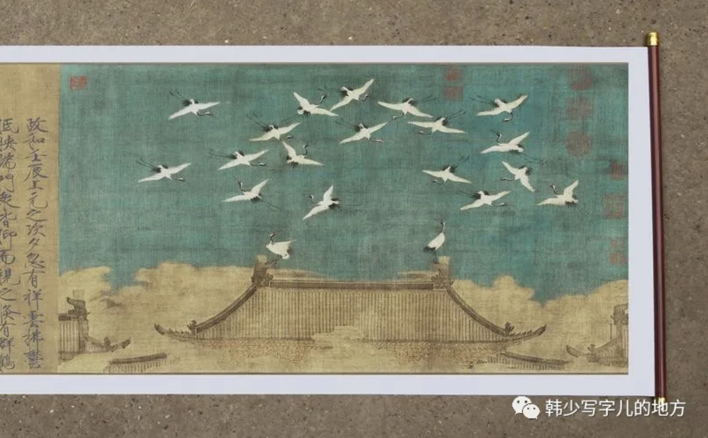
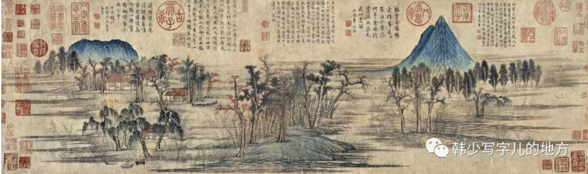
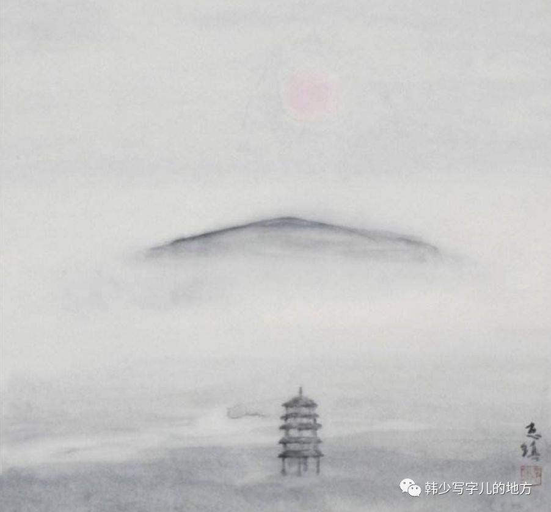

## 宋元山水意境

如果说雕塑艺术在六朝和唐达到了它的高峰，那么绘画的艺术高峰则在宋元。山水花鸟的高峰应属宋代。经过中晚唐的沉溺声色繁华之后，士大夫们一方面仍然延续着这种沉溺，同时又日益陶醉在另一个美的世界之中，这就是自然风景山水花鸟的世界。他们的现实生活既不再是在门阀士族压迫下要求奋发进取的初盛唐时代，也不同于谢灵运伐山开路式的六朝贵族的掠夺开发，而是一种满足于既得利益，希望长久保持和固定，从而将整个封建农村理想化、牧歌化的生活、心情、思绪和观念。

（宋元山水最迷人的地方，大概就在于，它已经不再是单纯地看山看水，而是把一种生活态度、阶层心理和时代心绪全都化进了山水之中。山水不只是自然对象，而是一种精神安顿的方式。人在现实中越来越倾向于守成、维持、内敛，于是艺术中也开始出现一种把现实秩序理想化、牧歌化的倾向。换句话说，山水画里的自然，其实从来都不是纯自然，而是被人的历史心境重新组织过的自然。）

——《瑞鹤图》

山水画重线条而不重色彩。它不重视光线明暗、阴影色彩的复杂多变之类，而重视具有一定稳定性的整体境界给人的情绪感染效果。

（这很能说明中国山水画的核心不是写实，而是境界。它不急于去复制世界在某一瞬间的视觉表象，而更重视一种经过提炼和沉淀后的整体气氛。西方绘画常常强调光影与体积，中国山水更强调气韵与整体。前者更像捕捉一个眼前的世界，后者则更像生成一个可供心灵栖居的世界。）

相比于北宋山水画的气势雄浑、全景式的客观山水，南宋则是从某个角度、某一对象出发，表达出思绪感受。北宋浑厚、整体、全景，南宋精巧、诗意、特写，前者雄浑、崇高，后者秀丽、工致。两美并峙，各领千秋。

（北宋和南宋的差异，不只是画法差异，更像是两种时代情绪的差异。北宋还保留着一种观看天下、统摄万物的宏大视野，所以它的山水往往高远、整全、雄浑；南宋则更像是在巨大现实收缩之后，把感受退回到某个局部、某个角落、某一瞬间的心绪之中。一个是我看天地，一个是天地映我。）

随着宋朝的衰落，蒙古族进据中原，严重破坏了生产力，大量汉族地主知识分子蒙受极大的屈辱和压迫，其中一部分或被迫或自愿放弃“学优则仕”的传统，把时间精力和情感思想寄托在文学艺术上。山水画的主导权由宋代的宫廷画院，终于落到了元代的在野士大夫和知识分子。

（这又一次证明，艺术样式的大变化背后，总有社会位置的大变化。仕途受阻、身份受损、现实失落之后，知识分子的表达冲动并没有消失，只是从政治场域转移到了艺术场域。于是绘画开始承担更多人格寄托和精神自述的功能。元代文人画之所以那么强调笔墨、意趣、气格，也正因为画家已经不再只是为朝廷作画，而是在借绘画保存自己。）

从元画大兴的一种中国画的独有现象，是画上题字作诗，以诗文来直接配合画画，相互补充和结合。与此同时，水墨画也就从此压倒青绿山水，居于画坛统治地位。

（诗书画合流，是中国艺术史上极有意味的一步。它意味着绘画不再满足于只靠图像本身说话，而是把文字、书法、诗意一并纳入画面。于是画不再只是看的对象，也成了读的对象。艺术门类之间的边界开始模糊，画面里装进去的，不只是山水花鸟，还有一个文人的心性、学养和人生姿态。）

——《鹊华秋色图》

到明清的扬州八怪，主观的意兴心绪压倒了一切，艺术家的个性特征被空前突出。

（到了这里，艺术的重心已经越来越明显地从对象转向主体了。画什么固然重要，但更重要的是“谁在画”“怎么画”“带着什么心绪画”。扬州八怪之所以特别，不只是因为题材怪、笔墨怪，而是因为艺术家的自我意识被极大强化了。山水花鸟不再只是自然物，而成了人格的投影、情绪的出口、审美态度的宣言。）

《月华图》——扬州八怪金农

当然，所有区分都只是相对大体的，不可生搬硬套，世界是复杂的，理论上的种种分析建构，是为了帮助而不是去束缚对艺术的理解。

（这句话非常重要。理论的意义，从来不是把艺术钉死在几个标签里，而是帮助我们更清楚地看见差异、脉络和结构。真正好的理解，不会因为有了分类就停止观看，反而会因为知道这些分类只是工具，而更愿意回到作品本身。）

## 明清文艺思潮

以小说戏曲为代表的明清文艺描绘的是世俗人情，一幅五花八门、多姿多彩的社会图画。

（如果说前代很多艺术还在努力处理“人与天”“人与道”“人与自然”的关系，那么到了明清，艺术越来越大规模地回到人与人的关系。世俗人情、家庭伦理、欲望纠葛、日常算计、荣辱沉浮，都开始成为主角。艺术的焦点越来越低，却也越来越宽，越来越贴近真实生活。）

哲学是时代的灵魂，反映时代的内在脉搏，从讲究事功的陈亮、叶适到提出工商皆本的黄梨洲和反对以理杀人的戴震，包括李贽，这是一股儒学异端，具有近代解放因素的民主思想。

艺术形式的美感逊色于生活内容的欣赏，高雅的趣味让路于世俗的真实。以《警世通言》、《拍案惊奇》为代表，标志着市民文学所达到的繁荣顶点。

（这并不意味着艺术下沉了，而意味着审美的重心变了。以前人们更在意辞采、格调、韵致，现在则越来越在意故事好不好看、人物像不像真的、情节能不能打动人。艺术从高雅趣味走向世俗真实，某种程度上也是审美权力下移的表现：越来越多普通人的经验，开始被承认为值得书写。）

对人情世俗的津津玩味、对荣华富贵的钦羡渴望、对性的解放的企望欲求、对“公案”神怪的广泛兴趣……尽管这里充满了小市民的种种庸俗、低级浅薄，但它们是有生命力的社会新生意识，是对长期封建王国和儒学正统的侵袭反抗。

（这很有启发性：庸俗不一定等于没有历史意义。很多看起来不够高雅、甚至有点粗俗的内容，恰恰可能携带着新的社会欲望和新的生活意识。人们开始公开谈论财富、情欲、奇闻、案件、世情，本身就说明传统的正统叙事已经无法完全压住现实生活的丰富性了。）

随着商业经济的空前发达，自然生理的性爱题材日益取得社会性的意义，自愿平等的男女情热，具有冲破重重封建礼俗去争取自由的价值和意义。

（爱情和性爱一旦不再只是私密情感，而带上社会性的意义，它就会具有某种解放性。因为它意味着个体开始要求按照自身情感来生活，而不是完全服从家族、礼法和等级秩序。明清文学里那些关于情的书写，看似儿女私情，实际上往往暗暗触碰着封建伦理最敏感的边界。）

这里没有远大的思想、深刻的内容，也没有抱负雄伟的主角和突出的个性、激昂的热情。它们是一些平淡无奇然而却真实丰富的世俗或幻想的故事。它们由说唱艺术演化而来，为了满足听众的要求，重视情节的曲折和细节的丰富成了小说这一文学艺术的特点。

元代少数民族的入侵造成了经济、文化的倒退，却也造就了士大夫与民间文学的结合，体现在元曲。以此发展出一种由说唱、表演、音乐、舞蹈相结合的艺术，创造了中国民族特色的戏曲。

（历史常常就是这样复杂，一种政治上的倒退，未必不会在文化上意外打开新的可能。元曲之所以重要，不只是因为它本身精彩，还因为它让文人传统与民间表达真正深度交汇。戏曲的形成，也意味着中国艺术不再只停留在纸面和书斋，而越来越进入舞台、进入身体、进入大众感官之中。）

## 浪漫洪流

李贽提倡讲真话，反对一切虚伪、矫饰。（与弗洛伊德的正视欲望吻合）李贽反对一切传统的观念束缚，甚至包括孔子在内。

（李贽把真实抬到了极高位置。讲真话，听起来像一句很简单的话，可在一个长期依赖礼法、名教、正统来维持秩序的社会里，这句话其实极具爆炸性。因为一旦要求真实，就意味着很多长期被遮蔽的欲望、情感和个体价值都要重新浮出来。）

“夫天生一人自有一人之用，不待取给于孔子而后足也。若必待取足于孔子，则千古以前无孔子，终不得为人乎？”人人均自有其价值，自有其可贵的真实，不必依据圣人，更不应装模作样假道学。这对当时的思想领域无疑有发聩振聋的启蒙作用。

（这一段几乎已经有了现代原子化个体意识的影子。人之为人的价值，不必再通过圣人来认证，这是一种极其深刻的思想松动。它意味着个体不再只是传统秩序的附属，而开始被承认为一个独立的、有自身意义的存在。思想史上最珍贵的时刻，常常就是这种人终于被重新看见的时刻。）

李贽的思想影响了一批文学家，他们发现在真实中自有力量。

（文学一旦相信真实本身有力量，它就会发生很大变化。因为它不再需要一味拔高、粉饰、装饰，而开始敢于写日常、写细节、写欲望、写脆弱、写不体面的东西。很多真正打动人的作品，恰恰不是因为它们多么崇高，而是因为它们诚实。）

像归有光的《项脊轩记》，透过细微的客观描景述事，抒情性却极为浓厚。它标志着正统古文已走进末梢，一个要求在内容上、形式上和语言上更接近日常生活的散文文学正在出现。

（这也是文学史上特别动人的一个变化：情感不再必须借助宏大题材和高亢腔调才能成立，反而可以通过极其细小的日常事物渗出来。文学越来越靠近日常生活，也就越来越靠近真实的人心。）

“庭有枇杷树，吾妻死之年所手植也，今已亭亭如盖矣。”人类的浓烈情感以一个极高的密度浓缩在这句话中。

这不是一两个人，而是一批人，不是一个短时期，而是持续了百余年的思潮。这确实是能称得上是具有近代解放气息的浪漫主义时代思潮。

（一个时代真正值得重视，不是因为有个别天才，而是因为它出现了一整股持续的精神潮流。明中后期的可贵，正在于它不是孤立地冒出几个异端人物，而是很多不同领域的人都在从不同方向冲击传统，这才使它真正具有时代意义。）

“良辰美景奈何天，赏心乐事谁家院？朝飞暮卷，云霞翠轩雨丝风片，烟波画船。”

——《牡丹亭》

（《牡丹亭》的伟大，就在于它把情推到了几乎足以和礼法抗衡的位置。美景、良辰、情欲、梦境，这一切都不再只是点缀，而成为人生真正值得争取和守护的东西。它让爱情不仅是爱情，也成了一种反抗僵硬秩序的力量。）

清朝的建立，社会保守化，资本主义因素在清初被全面打了下去。上层浪漫主义则变为感伤文学，以此表达对黑暗社会的不满。（人生的空幻感）

“俺曾见金陵玉殿莺啼晓，秦淮水榭花开早，谁知道容易冰消！眼看他起朱楼，眼看他宴宾客，眼看他楼塌了！这青苔碧瓦堆，俺曾睡风流觉，将五十年兴亡看饱。”《桃花扇》

（这里的感伤已经不是明代那种向外冲的浪漫了，而是一种带着幻灭感的回望。眼见繁华起，眼见繁华落，这种历史感让个人情绪和家国兴亡叠在一起。于是感伤不再只是私人情绪，而成了一种文明晚期特有的苍凉。）

复古主义把一切弄得乌烟瘴气、僵死，明末清初的民主民族的伟大思想已成陈迹。那是没有曙光的长夜，终于使中国落在欧洲后面。在文艺领域，真正作为这个封建末世的总结的，要算《红楼梦》。

（当一个时代失去真正的新生力量时，复古就常常不再是回望传统的资源，而变成对现实活力的压抑。文艺在这种时候反而会承担起更沉重的总结功能：它不再开路，而是存档、反思、清算和哀悼。《红楼梦》正是在这种历史阴影下出现的。）

关于《红楼梦》，人们已经说过千言万语，大概还有万语千言要说。一切在富丽堂皇、欢声笑语中不可救药地垮下来，糜烂腐朽。严峻的批判现实主义于是成熟了。（《红楼梦》是对《桃花扇》的延续和发展。）《红楼梦》终于成了百读不厌的封建末世的百科全书。

（《红楼梦》的伟大，也许就在于它不是简单写一个家族败落，而是把一个时代、一个阶层、一套生活方式如何从内部慢慢腐烂，全都写了出来。它没有靠口号来批判现实，而是靠极其丰饶的生活细节，让你自己看见一切是怎样一步步走向崩塌的。真正成熟的现实主义，大概正是如此。）

对中国古典文艺的匆匆巡礼，到此告一段落。跑得如此之快，也就很难欣赏任何局部的丰富。但不知鸟瞰式的观花，能够获得一个虽笼统却并不模糊的印象否？

凝结在上述种种古典作品中的中国民族的审美趣味、艺术风格，为什么仍然与今天人们的感受爱好相吻合？为什么会使我们有那么多的亲切感呢？人类的心理结构是否正是一种历史沉淀的产物呢？也许正是它蕴藏了艺术作品的永恒性的秘密？也许，应该倒过来，艺术作品的永恒性蕴藏了也提供着人类心理共同结构的秘密？

（我觉得这也许正是整本书最深的问题之一：为什么古人留下的艺术，今天仍然能打动我们？如果审美真的只是主观偏好，那这种跨越时代的共鸣就难以解释。也许人的心理结构确实有一部分是在历史中慢慢沉淀出来的，而伟大的艺术恰恰触碰到了这种沉淀极深、变化极慢的层次。）

美作为感性与理性、形式与内容、真与善、合规律性与合目的性的统一，与人性一样，是人类文明的伟大成果。那么尽管如此匆忙的历史巡礼，如此粗糙的随笔札记，对于领会和把握这个巨大而重要的成果，该不只是一件闲情逸致或毫无意义的事情吧？

（美从来都不只是表面上的好看而已。它背后牵连着理性、感性、真、善、形式、内容，也牵连着一个文明如何理解人、塑造人、安顿人。正因如此，谈美从来都不是闲情逸致。它关乎我们究竟如何理解自己，又如何理解这一路走来的文明。）

俱往矣，然而，美的历程却是指向未来的。
（最吸引人的东西不来自某个时代，而是来自这一套照常传承了几千年的美学历史现在运转到了我们脚下。）
